# AI Agent Swarm - Visual Architecture Diagrams

This document contains visual Mermaid diagrams for the AI Agent Swarm system architecture.

---

## 1. High-Level System Architecture

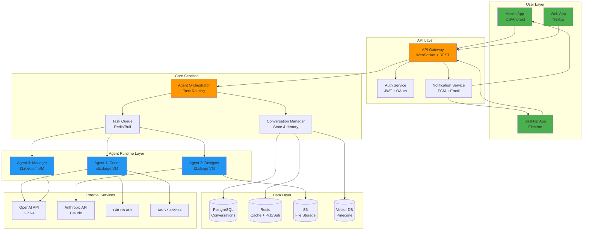

---

## 2. Agent Internal Architecture

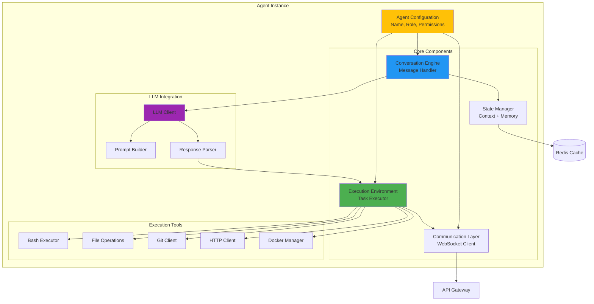

---

## 3. Conversation Flow Sequence

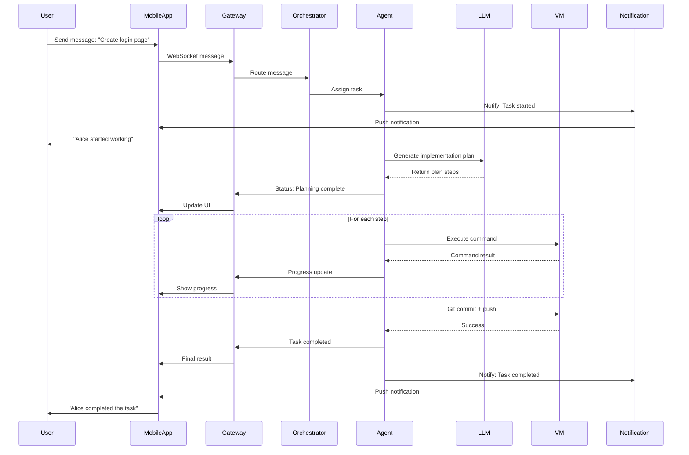

---

## 4. Multi-Agent Collaboration Flow

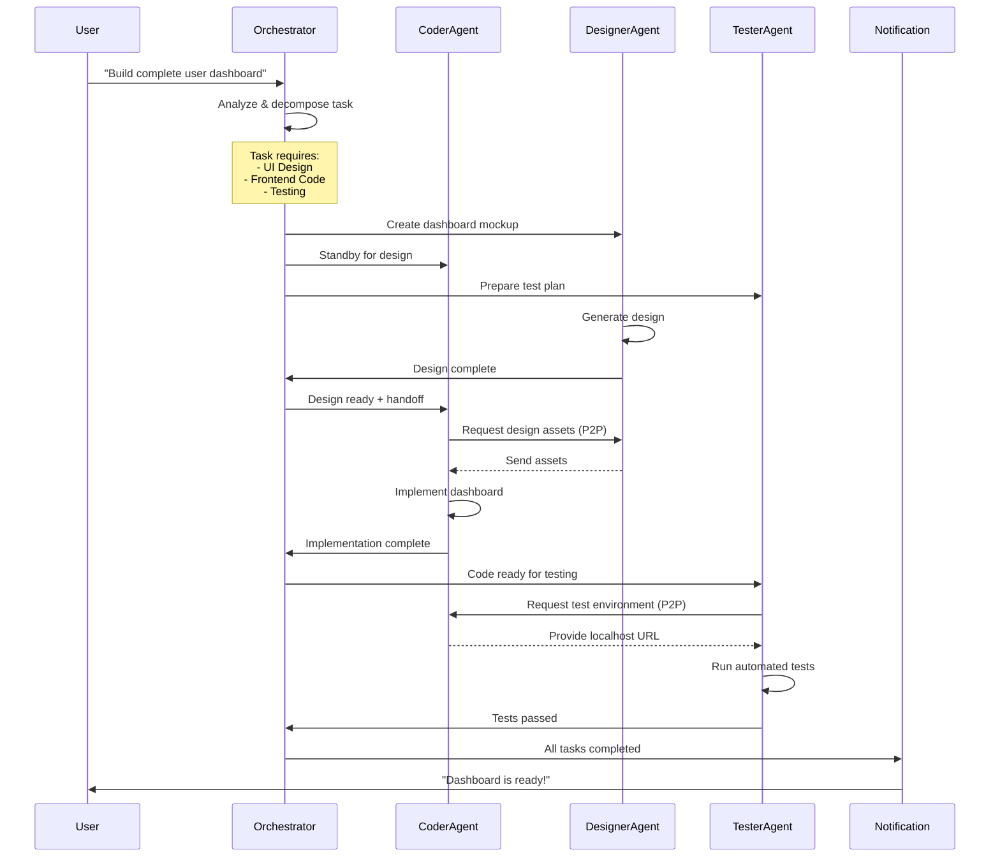

---

## 5. Agent State Machine

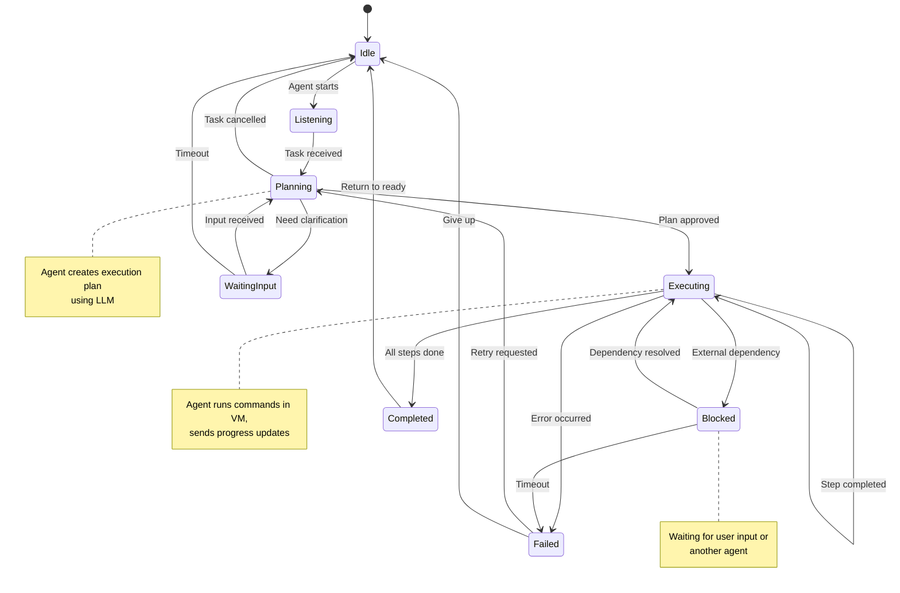

---

## 6. Data Flow Architecture

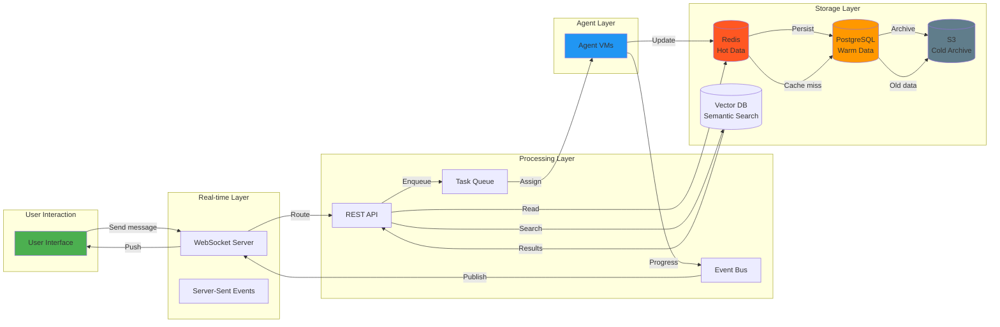

---

## 7. Security Architecture

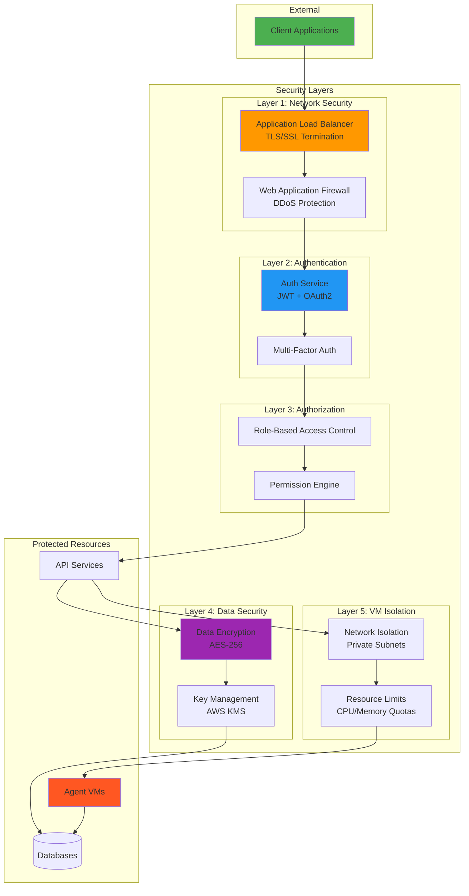

---

## 8. Deployment Architecture (AWS)

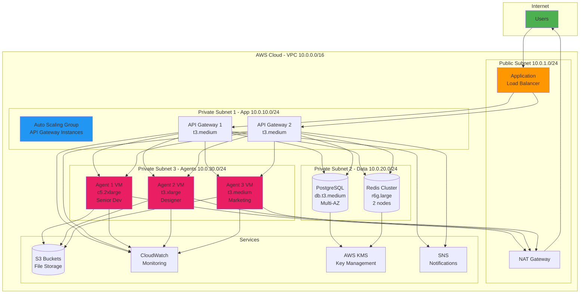

---

## 9. Notification System Flow

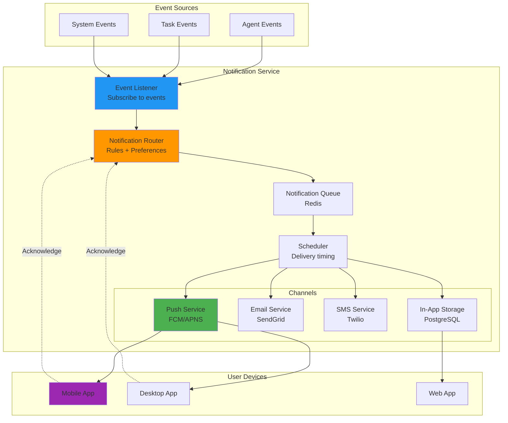

---

## 10. Agent Lifecycle Management

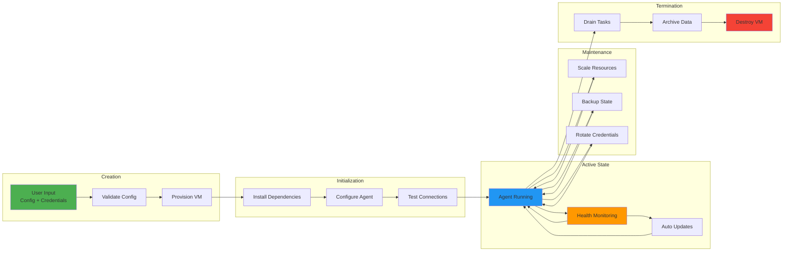

---

## 11. Cost Optimization Flow

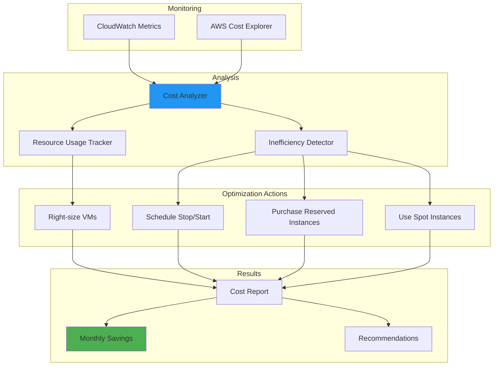

---

## Summary

These diagrams provide visual representations of:

1. **System Architecture** - Overall component organization
2. **Agent Internals** - How individual agents work
3. **Conversation Flow** - Message handling sequence
4. **Multi-Agent Collaboration** - How agents work together
5. **State Management** - Agent state transitions
6. **Data Flow** - How data moves through the system
7. **Security Layers** - Security implementation
8. **AWS Deployment** - Infrastructure layout
9. **Notification System** - How users stay informed
10. **Lifecycle Management** - Agent creation to destruction
11. **Cost Optimization** - Managing expenses

These diagrams complement the detailed architecture document and provide a quick visual reference for understanding the system design.
